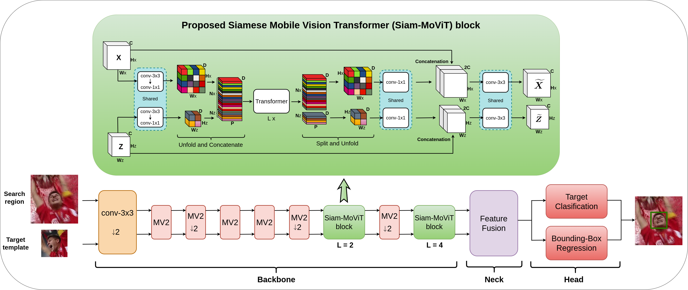

# [Mobile Vision Transformer-based Visual Object Tracking](https://arxiv.org/abs/2309.05829) [BMVC2023] official implementation


## News
**`14-09-2023`**: The pretrained tracker model is released

**`13-09-2023`**: The paper is available on [arXiv](https://arxiv.org/abs/2309.05829) now

**`22-08-2023`**: The MVT tracker training and inference code is released

**`21-08-2023`**: The paper is accepted at BMVC2023

## Installation

Install the dependency packages using the environment file `mvt_pyenv.yml`.

Generate the relevant files:
```
python tracking/create_default_local_file.py --workspace_dir . --data_dir ./data --save_dir ./output
```
After running this command, modify the datasets paths by editing these files
```
lib/train/admin/local.py  # paths about training
lib/test/evaluation/local.py  # paths about testing
```

## Training

* Set the path of training datasets in `lib/train/admin/local.py`
* Place the pretrained backbone model under the `pretrained_models/` folder
* For data preparation, please refer to [this](https://github.com/botaoye/OSTrack/tree/main)
* Uncomment lines `63, 67, and 71` in the [base_backbone.py](https://github.com/goutamyg/MVT/blob/main/lib/models/mobilevit_track/base_backbone.py) file.  
* Run
```
python tracking/train.py --script mobilevit_track --config mobilevit_256_128x1_got10k_ep100_cosine_annealing --save_dir ./output --mode single
```
* The training logs will be saved under `output/logs/` folder

## Pretrained tracker model
The pretrained tracker model can be found [here](https://drive.google.com/drive/folders/1RAdn3ZXI_G7pBj4NDbtQVFPkClVd1IBm)

## Tracker Evaluation

* Update the test dataset paths in `lib/test/evaluation/local.py`
* Place the [pretrained tracker model](https://drive.google.com/drive/folders/1RAdn3ZXI_G7pBj4NDbtQVFPkClVd1IBm) under `output/checkpoints/` folder 
* Run
```
python tracking/test.py --tracker_name mobilevit_track --tracker_param mobilevit_256_128x1_got10k_ep100_cosine_annealing --dataset got10k_test/trackingnet/lasot
```
* Change the `DEVICE` variable between `cuda` and `cpu` in the `--tracker_param` file for GPU and CPU-based inference, respectively  
* The raw results will be stored under `output/test/` folder

## Acknowledgements
* We use the Separable Self-Attention Transformer implementation and the pretrained `MobileViT` backbone from [ml-cvnets](https://github.com/apple/ml-cvnets). Thank you!
* Our training code is built upon [OSTrack](https://github.com/botaoye/OSTrack) and [PyTracking](https://github.com/visionml/pytracking)

## Citation
If our work is useful for your research, please consider citing:

```Bibtex
@InProceedings{Gopal2023Mob,
  author       = "Goutam Yelluru Gopal and Maria Amer",
  title        = "Mobile Vision Transformer-based Visual Object Tracking",
  booktitle    = "34th British Machine Vision Conference (BMVC)",
  year         = "2023",
  pages        = "8",
  month        = "Nov. 20-24",
  address      = "Aberdeen, UK",
}
```
